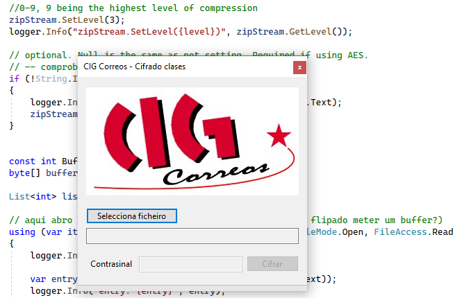

# CIG Correos cifrado clases

App para cifrar ficheiros.

Empregado na formación dada por CIG Correos.

## Uso

Xenera un .zip cifrado dun ficheiro .mp4 indicado.

- Seleccionar un ficheiro (.mp4)
- Cifrar

## Librarías

Emprega https://github.com/icsharpcode/SharpZipLib para comprimir e cifrar ficheiros

## Author

Alexandre Espinosa Menor
aemenor@gmail.com

https://github.com/alexandregz/
